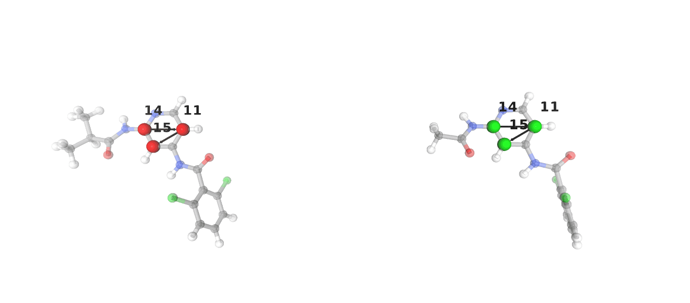
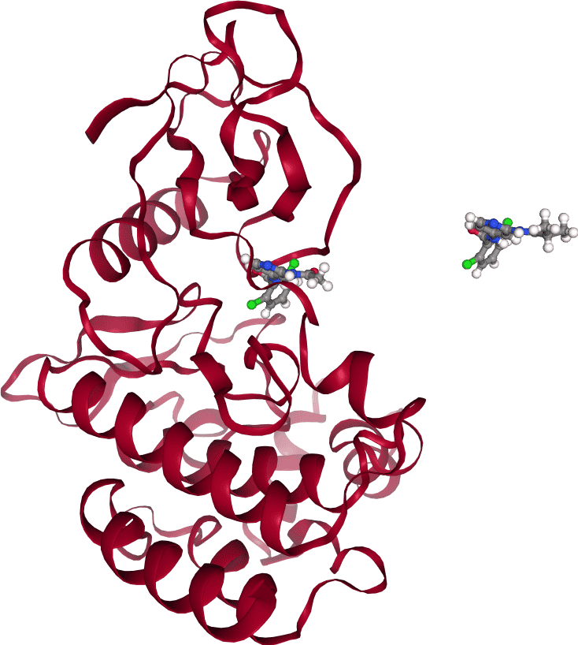

==========================
Alchemical Transfer Method
==========================
In this tutorial, you will use BioSimSpace to set up and run a Relative Binding
Free Energy (RBFE) calculation using the `alchemical transfer method
<https://www.compmolbiophysbc.org/atom-openmm>`__ (ATM) on a pair of ligands bound to
`Tyrosine kinase 2 <https://en.wikipedia.org/wiki/Tyrosine_kinase_2>`__ (TYK2).

.. note ::
   ATM calculations are currently only available in OpenMM. As such, an environment
   containing OpenMM is required to run this tutorial.

--------------------------
System Setup
--------------------------
Import :mod:`BioSimSpace` using

>>> import BioSimSpace as BSS

Now load the set of molecules from a URL, via
:func:`BioSimSpace.IO.readMolecules` NEED TO UPLOAD THE MOLECULES:

>>> url = BSS.tutorialUrl()
>>> protein = BSS.IO.readMolecules([f"{url}/tyk2.prm7", f"{url}/tyk2.rst7"])[0]
>>> lig1 = BSS.IO.readMolecules([f"{url}/ejm_31.prm7", f"{url}/ejm_31.rst7"])[0]
>>> lig2 = BSS.IO.readMolecules([f"{url}/ejm_43.prm7", f"{url}/ejm_43.rst7"])[0]

In order to run an ATM calculation a single system, containing both ligands and
the protein in their correct positions, is required. This can be created using
functionality provided in :func:`BioSimSpace.FreeEnergy.AToMSetup`.

ATM calculation require that both ligands be present in the
system simultaneously, with one ligand bound to the receptor and the other free
in the solvent. As such, the first decision to be made when setting up an ATM
calculation is which ligand will be bound and which will be free. It is
important to note that, while one ligand is chosen to be bound, `both` ligands
will bound to the receptor at some point during the calculation, the choice made
here simply defines the initial state of the system, and by extension the
`direction` of the calculation.

First, create an :class:`AToMSetup` object, which will be used to create the
system.

>>> AToM_factory = BSS.FreeEnergy.AToMSetup(receptor=protein, ligand_bound=lig1, ligand_free=lig2)

Before an AToM-ready system can be created there are decisions to be made
regarding the system setup, namely which atoms will be used to
define the rigid cores of the ligands, as well as the indices of the atoms that
make up the centre of mass of each molecule.

The choice of rigid core atoms is vital to the success of an ATM RBFE
calculation, and as such BioSimSpace provides a helper function to visualise the
choice made by the user. 

>>> BSS.FreeEnergy.AToMSetup.viewRigidCores(ligand_bound=lig1, ligand_free=lig2, ligand_bound_rigid_core=[14, 11, 15], ligand_free_rigid_core=[14, 11, 15])

.. note ::

    In this case the choice of rigid core atoms is the same for both ligands, 
    but this is not always the case. The choice of these atoms should be made 
    on a ligand to ligand basis. 

    For help in choosing the correct atoms, see the `Gallichio lab tutorial
    <https://www.compmolbiophysbc.org/atom-openmm>`__.

Now that a sensible choice of rigid core atoms has been made, there are a few
more choices to be made before the system can be prepared. The most important of
these is the choice of displacement vector, which defines the direction and
distance at which the free ligand will be placed relative to the bound ligand.
It is generally recommended that this displacement be at least 3 layers of water
molecules (> 10 Å) thick. If no displacement is provided a default choice of
[20Å, 20Å, 20Å] will be used.

This is also the point at which a custom set of atoms can be chosen to define the
centre of mass of both the ligands and the protein. In the majority of cases it
should not be necessary to change the default choice of atoms, but the option is
there if needed and can be set using the ``ligand_bound_com_atoms`` and
``ligand_free_com_atoms`` arguments.

Now that all the choices have been made, the system can be prepared

>>> system, AToMdata = AToM_factory.prepare(ligand_bound_rigid_core=[14, 11, 15], ligand_free_rigid_core=[14, 11, 15])

The ``prepare`` function returns a pair of objects, the first is the prepared
protein-ligand-ligand system, and the second is a dictionary containing the
choices made during the setup process. This ``AToMdata`` object will be passed to
protocols for minimisation, equilibration and production in order to ensure that
the system is correctly set up.

The prepared system can be visualised using BioSimSpace's built in visualisation

>>> v = BSS.Notebook.View(system)
>>> v.system()

Now all that remains is to solvate the system.

>>> solvated = BSS.Solvent.tip3p(molecule=system, box=3 * [7 * BSS.Units.Length.nanometer])

--------------------------
Minimisation and Equilibration
--------------------------

Now that the system is fully prepared, the next step is to minimise and
equilibrate it. The minimisation and equilibration of systems using alchemical
transfer is more complex than standard systems, and is a multi-stage process.

First, if positional restraints are needed, which is generally recommended for
ATM calculations, the decision of which atoms to restrain must be made. A
good choice for these atoms are the alpha carbons of the protein. These can be
found using BioSimSpace search syntax.

>>> CA = [atom.index() for atom in solvated.search("atomname CA")]

The system can now be minimised. Unlike standard minimisation, the minimisation
of an ATM system requires that several restraints be applied from the start.
These restraints are: core alignment, applied to atoms determined earlier, which
can be turned on or off by passing the ``core_alignment`` argument; positional
restraints applied to the alpha carbons listed above, set using the
``restraint`` argument; and a centre of mass distance restraint, which maintains
the distance between the centre of masses of the ligands, as well as the
distance between the centre of mass of the protein and ligands, set using the
``com_distance_restraint`` argument. The strength of these restraints is automatically
set to a set of default values that are generally suitable for most systems, but
can also be set manually by passing the relevant arguments to
:data:`BioSimSpace.Protocol.AToMMinimisation`.

>>> minimisation = BSS.Protocol.AToMMinimisation(data=AToMdata, core_alignment=True, restraint=CA, com_distance_restraint=True)

This minimisation protocol can now be run as a standard BioSimSpace OpenMM
process.

>>> minimisation_process = BSS.Process.OpenMM(solvated, minimisation)
>>> minimisation_process.start()
>>> minimisation_process.wait()
>>> minimised = minimisation_process.getSystem(block=True)

Now the first equilibration can be run. Similar to the minimisation, this
protocol has several restraints that are applied from the start. 

>>> equilibration = BSS.Protocol.AToMEquilibration(
...    data=AToMdata, 
...    core_alignment=True, 
...    restraint=CA, 
...    com_distance_restraint=True,
...    runtime="100ps"
...)
>>> equilibrate_process = BSS.Process.OpenMM(minimised, equilibration, platform="CUDA")
>>> equilibrate_process.start()
>>> equilibrate_process.wait()
>>> equilibrated = equilibrate_process.getSystem(block=True)

.. note ::
   The equilibration protocol is set to run for 100ps. This is a relatively
   short time, and should be increased for production runs.

   Here the "CUDA" platform is explicitly set. It is highly recommended to use
   a GPU platform for equilibration and production runs, as the calculations are
   computationally expensive.

Now that the system has been minimised and equilibrated without the ATMForce
being present, it needs to be added to the system. The first stage of this
introduction is annealing, which by default will gradually increase the value of λ
from 0 to 0.5 over a number of cycles.

>>> annealing = BSS.Protocol.AToMAnnealing(
...    data=AToMdata,
...    core_alignment=True,
...    restraint=CA,
...    com_distance_restraint=True,
...    runtime="100ps"
...    anneal_numcycles=10
...)
>>> annealing_process = BSS.Process.OpenMM(equilibrated, annealing, platform="CUDA")
>>> annealing_process.start()
>>> annealing_process.wait()
>>> annealed = annealing_process.getSystem(block=True)

The annealing process is fully customisable, and any number of λ-specific values
can be annealed. See :data:`BioSimSpace.Protocol.AToMAnnealing` for full the
full list of annealing options.

The final stage of the ATM minimisation and equilibration protocol is a
post-annealing equilibration run, this time with the ATMForce present at λ=0.5.

>>> post_anneal_equilibration = BSS.Protocol.AToMEquilibration(
...    data=AToMdata,
...    core_alignment=True,
...    restraint=CA,
...    com_distance_restraint=True,
...    use_atm_force=True,
...    lambda_1 = 0.5,
...    lambda_2 = 0.5,
...    runtime="100ps"
...)
>>> post_anneal_equilibration_process = BSS.Process.OpenMM(annealed, post_anneal_equilibration, platform="CUDA")
>>> post_anneal_equilibration_process.start()
>>> post_anneal_equilibration_process.wait()
>>> min_eq_final = post_anneal_equilibration_process.getSystem(block=True)

.. note ::
   A frequent soource of instability in ATM production runs is an overlap between the 
   bound ligand and the protein after a swap in direction. If this is encountered 
   the first step taken should be to increase the runtime of the post-annealing equilibration.
   This gives the system time to adjust to the presence of the new ligand, without the 
   reduced stability associated with a swap in direction.

--------------------------
Production and Analysis
--------------------------

The system is now ready for production. The key decision to be made before
beginning is the number of lambda windows, set using the ``num_lambda``
argument. If this value is not set, a default of 22 will be set by BioSimSpace.

.. note ::
   Keep in mind that, due to the nature of the alchemical transfer method, a single
   production run contains both the forward and reverse direction of both the free
   and bound legs, and therefore a larger than usual number of lambda windows is
   required for a well sampled result.

In addition to setting the number of lambdas, any or all of the λ-specific
values can be manually set, with the only condition being that the lists
provided are all of the same length, specifically they must have length equal to
``num_lambda``. See :data:`BioSimSpace.Protocol.AToMProduction` for a full list
of options.

In the case of this TYK2 perturbation, the default values for ``alpha`` and
``uh`` will need to be set manually, as the default values are not suitable in
this case.

>>> alpha = 22 * [0.1]
>>> uh = 22 * [110.0]
>>> output_directory = "tyk2_atm"
>>> production_atm = BSS.Protocol.AToMProduction(
...    data=AToMdata,
...    core_alignment=True,
...    restraint=CA,
...    com_distance_restraint=True,
...    runtime = "1ns",
...    num_lambda=22,
...    alpha=alpha,
...    uh=uh,
)
>>> production_process = BSS.FreeEnergy.AToM(
...    system=min_eq_final,
...    protocol=production_atm,
...    work_dir=output_directory,
...    platform="CUDA"
...    setup_only=True
)

The ``setup_only`` flag is set to ``True`` here, this means that all input files
will be created, but nothing will be run. It is recommended to run production
protocols on HPC resources where multiple GPUs are available, as the calculations
can be very computationally expensive. Running the generated inputs is as simple
as running the ``OpenMM.py`` script contained in each of the labelled ``lambda``
folders of the output directory.

Once production is complete, the results can be analysed using the built-in
BioSimSpace UWHAM analysis tool.

>>> BSS.FreeEnergy.AToM.analyse(output_directory)

This will give the ΔΔG value for the perturbation, as well as the error (both in
kcal/mol). 

That concludes the tutorial on setting up and running an ATM RBFE calculation!
For further information please visit the :data:`API documentation
<BioSimSpace.FreeEnergy>`, and for further information on the alchemical
transfer method, see the `Gallichio lab website
<https://www.compmolbiophysbc.org/atom-openmm>`__.