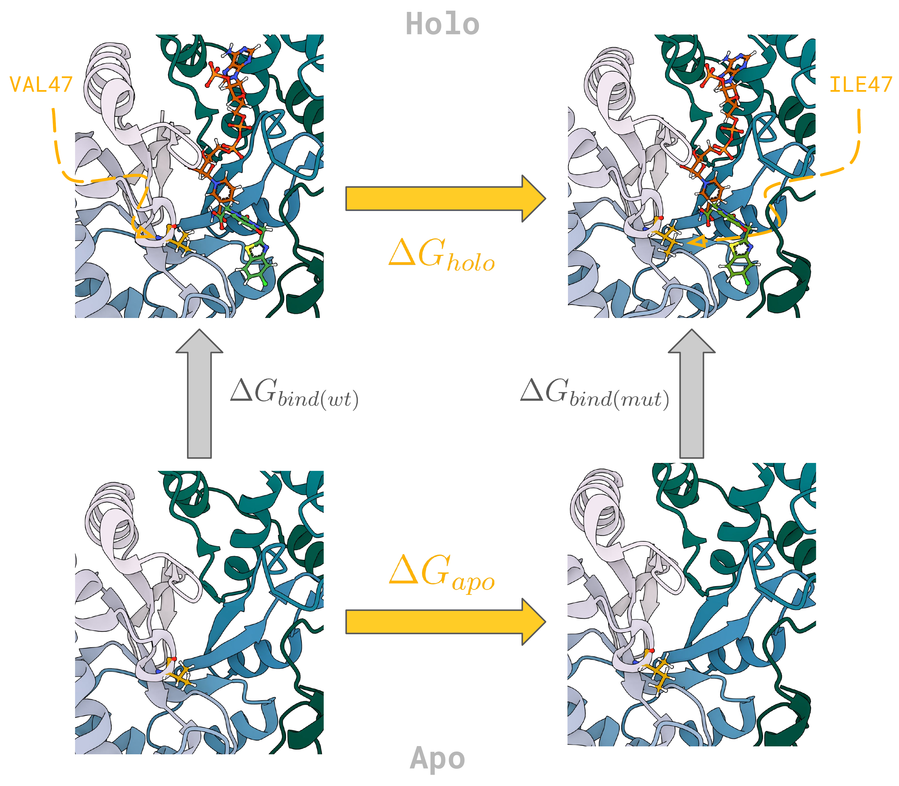
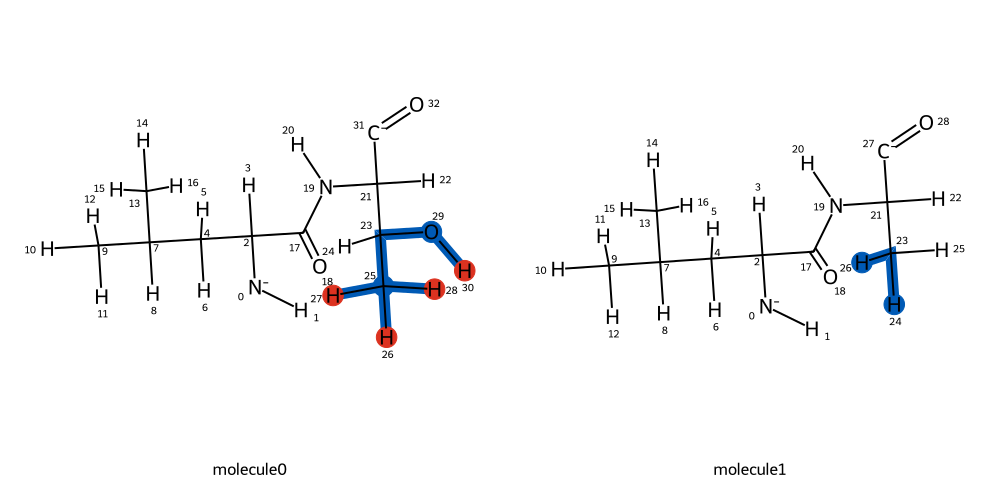
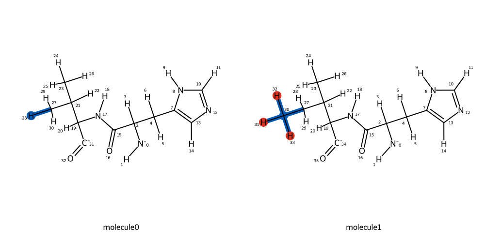
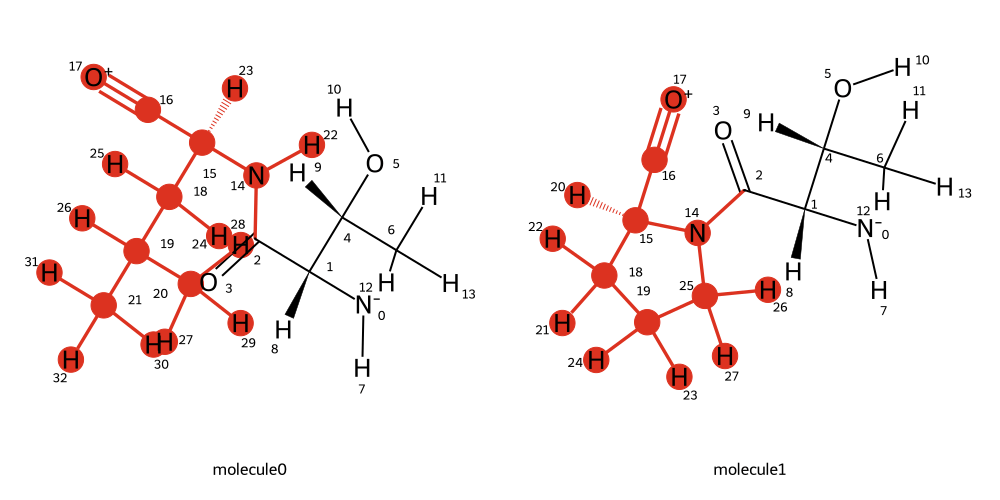
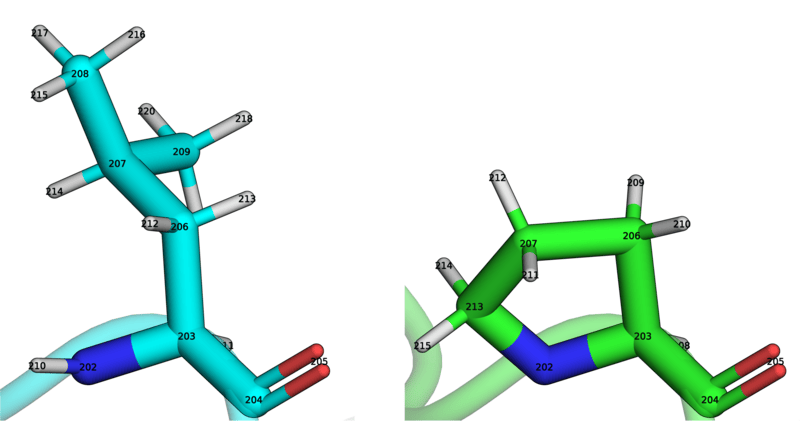
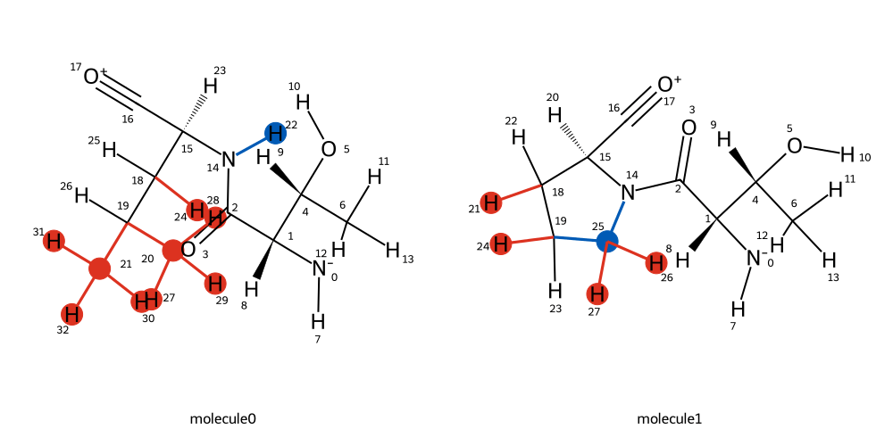

============================
Alchemical Protein Mutations
============================

Introduction
============

In this tutorial you will learn how to use BioSimSpace’s mapping
functionality to set up alchemical calculations in order to compute the
change in the binding affinity of a ligand as a result of a protein
mutation. Specically, we are going to focus on two proteins, first a set
up of a single alchemical point mutation on ubiquitin, and second a set
up on `aldose
reductase <https://en.wikipedia.org/wiki/Aldose_reductase>`__ (AR),
which is a drug target for the treatment of diabetic nephropathy. It is
recommended to complete `previous BioSimSpace
tutorials <https://github.com/OpenBioSim/biosimspace_tutorials>`__
before attempting this one.

The relative change in the binding affinity as a result of a mutation,
:math:`\Delta \Delta G_{mut}` can be calculated from the difference
between free energy of mutation in the holo (bound) and apo (unbound)
simulation legs, i.e.:

.. math::

   \Delta \Delta G_{mut} = \Delta G_{holo} - \Delta G_{apo}

To get started, let’s go through a simple example of generating the
required input files in order to set up an alchemical mutation.

Simple Case - Input File Generation
-----------------------------------

In order to create an alchemical protein system in BioSimSpace, we need
two input protein structures, a wild-type and a mutant. We also need to
make sure that the atom ordering between the two proteins is identical.
Don’t worry, this is an easy assumption to satisfy. We will load a
structure ``1UBQ`` via `sire <https://sire.openbiosim.org/>`__, which
comes with bundled with BioSimSpace:

.. code:: ipython3

    import BioSimSpace as BSS
    import sire as sr
    mols = sr.load("1UBQ")

.. parsed-literal::

    INFO:rdkit:Enabling RDKit 2024.03.3 jupyter extensions
    INFO:numexpr.utils:Note: NumExpr detected 20 cores but "NUMEXPR_MAX_THREADS" not set, so enforcing safe limit of 8.
    INFO:numexpr.utils:NumExpr defaulting to 8 threads.

.. parsed-literal::

    Using cached download of 'https://files.rcsb.org/download/1UBQ.pdb.gz'...
    Using cached unzipped file './1UBQ.pdb'...

There are multiple of ways of generating a mutant structure from a
wild-type protein, some examples are: - `Pymol Mutagenesis
Plugin <https://pymolwiki.org/index.php/Mutagenesis>`__ (when exporting
the mutant structure, you want to make you select ‘retain atom ids’
under ‘PDB Options’, or pass both input structures through *pdb4amber*)
-
`HTMD <https://software.acellera.com/htmd/tutorials/system-building-protein-protein.html#mutate-modified-residues>`__
- `FoldX <https://foldxsuite.crg.eu/command/BuildModel>`__ -
`pdb4amber <https://ambermd.org/tutorials/basic/tutorial9/index.php>`__

For this simple case we are going to use *pdb4amber* to mutate a
threonine at position 9 to an alanine residue. First we are going to
pass the wild-type protein from the crystal structure through
*pdb4amber* in order create a consistent atom ordering between wild-type
and mutant structures:

.. code:: ipython3

    !pdb4amber --reduce --dry --add-missing-atoms -o 1UBQ_dry_wt.pdb 1UBQ.pdb

.. parsed-literal::

    ==================================================
    Summary of pdb4amber for: 1UBQ.pdb
    ===================================================

    ----------Chains
    The following (original) chains have been found:
    A

    ---------- Alternate Locations (Original Residues!))

    The following residues had alternate locations:
    None
    -----------Non-standard-resnames

    ---------- Missing heavy atom(s)

    None

Next, we are going to create a mutant structure:

.. code:: ipython3

    !pdb4amber --reduce --dry -o 1UBQ_dry_t9a.pdb -m "9-ALA" --add-missing-atoms 1UBQ_dry_wt.pdb

.. parsed-literal::

    ==================================================
    Summary of pdb4amber for: 1UBQ_dry_wt.pdb
    ===================================================

    ----------Chains
    The following (original) chains have been found:

    ---------- Alternate Locations (Original Residues!))

    The following residues had alternate locations:
    None
    -----------Non-standard-resnames

    ---------- Missing heavy atom(s)

    ALA_9 misses 1 heavy atom(s)

.. container:: alert alert-block alert-warning

   Warning: This is a simple, but ultimately a crude way of generating a
   mutant structure. Different factors such as sidechain rotomers,
   packing and protonation states need to be taken into the account in
   order to accurately and robustly describe the mutant end-state.

Simple Case - Alchemical System Generation
------------------------------------------

Now that correct input files have been created, we can now proceed to
create an alchemical protein in BioSimSpace. Let’s load our two
proteins:

.. code:: ipython3

    protein_wt = BSS.IO.readMolecules("1UBQ_dry_wt.pdb")[0]
    protein_mut = BSS.IO.readMolecules("1UBQ_dry_t9a.pdb")[0]

Next, we want to parametrise them with our forcefield of choice:

.. code:: ipython3

    protein_wt = BSS.Parameters.ff14SB(protein_wt).getMolecule()
    protein_mut = BSS.Parameters.ff14SB(protein_mut).getMolecule()

Now we want to compute the mapping between the two proteins, first let’s
figure out the residue index of our residue of interest (ROI):

.. code:: ipython3

    protein_wt.getResidues()[7:10]

.. parsed-literal::

    [<BioSimSpace.Residue: name='LEU', molecule=5, index=7, nAtoms=19>,
     <BioSimSpace.Residue: name='THR', molecule=5, index=8, nAtoms=14>,
     <BioSimSpace.Residue: name='GLY', molecule=5, index=9, nAtoms=7>]

.. code:: ipython3

    protein_mut.getResidues()[7:10]

.. parsed-literal::

    [<BioSimSpace.Residue: name='LEU', molecule=7, index=7, nAtoms=19>,
     <BioSimSpace.Residue: name='ALA', molecule=7, index=8, nAtoms=10>,
     <BioSimSpace.Residue: name='GLY', molecule=7, index=9, nAtoms=7>]

We can see that the residue with the index value of 8 are different
between the two proteins. Let’s pass this value to the
`BioSimSpace.Align.matchAtoms <https://biosimspace.openbiosim.org/api/generated/BioSimSpace.Align.matchAtoms.html>`__
function:

.. code:: ipython3

    mapping = BSS.Align.matchAtoms(molecule0=protein_wt, molecule1=protein_mut, roi=[8])

.. container:: alert alert-block alert-info

   Note: You can also pass multiple residues of interest indices to the
   mapping if you wish to mutate several residues simultaneously.

Now that the mapping has been computed, we can visualise it:

.. code:: ipython3

    BSS.Align.viewMapping(protein_wt, protein_mut, mapping, roi=8, pixels=500)

The computed atom mapping shows that both hydroxyl and methyl groups in
the threonine side chain will be transformed into hydrogen atoms
respectively. We can now proceed to align the two residues of interest:

.. code:: ipython3

    aligned_wt = BSS.Align.rmsdAlign(molecule0=protein_wt, molecule1=protein_mut, roi=[8])

Finally, we can create a merged alchemical protein system:

.. code:: ipython3

    merged_protein = BSS.Align.merge(aligned_wt, protein_mut, mapping, roi=[8])

The alchemical protein can now be solvated, ionised and exported to
different file formats, for example GROMACS or `SOMD2, our OpenMM-based
FEP engine <https://github.com/OpenBioSim/somd2>`__:

.. code:: ipython3

    merged_system = merged_protein.toSystem()

    # solvate the system with the padding of 15 angstroms
    padding = 15 * BSS.Units.Length.angstrom
    box_min, box_max = merged_system.getAxisAlignedBoundingBox()
    box_size = [y - x for x, y in zip(box_min, box_max)]
    box_sizes = [x + padding for x in box_size]

    box, angles = BSS.Box.rhombicDodecahedronHexagon(max(box_sizes))
    solvated_system = BSS.Solvent.tip3p(molecule=merged_system, box=box, angles=angles, ion_conc=0.15)

.. code:: ipython3

    # export the solvated system to GROMACS input files
    BSS.IO.saveMolecules("apo_ubiquitin_t9a", solvated_system, ["gro87", "grotop"])

.. code:: ipython3

    # export the solvated system to SOMD2 input file
    BSS.Stream.save(solvated_system, "apo_ubiquitin_t9a")

Aldose Reductase - Alchemical System Generation
===============================================

Apo System
----------

Now we are going to focus on the aldose reductase system and set up an
alchemical transformation in both apo and holo forms of the protein. The
input files (2PDG_8.0) were taken from the SI of a `paper by Aldeghi et.
al <https://pubs.acs.org/doi/full/10.1021/acscentsci.8b00717>`__,
residue 47 mutated via PyMol (V47I), and standardised via *pdb4amber*.

.. code:: ipython3

    protein_wt = BSS.IO.readMolecules(BSS.IO.expand(BSS.tutorialUrl(), "aldose_reductase_dry.pdb"))[0]
    protein_mut = BSS.IO.readMolecules(BSS.IO.expand(BSS.tutorialUrl(), "aldose_reductase_v47i_dry.pdb"))[0]

We can use ``ensure_compatible=False`` in order to get tLEaP to re-add
the hydrogens for us:

.. code:: ipython3

    protein_wt = BSS.Parameters.ff14SB(protein_wt, ensure_compatible=False).getMolecule()
    protein_mut = BSS.Parameters.ff14SB(protein_mut, ensure_compatible=False).getMolecule()

This time we are going to automatically detect the different residues
between the two proteins:

.. code:: ipython3

    roi = []
    for i, res in enumerate(protein_wt.getResidues()):
        if res.name() != protein_mut.getResidues()[i].name():
            print(res, protein_mut.getResidues()[i])
            roi.append(res.index())

.. parsed-literal::

    <BioSimSpace.Residue: name='VAL', molecule=22664, index=45, nAtoms=16> <BioSimSpace.Residue: name='ILE', molecule=22666, index=45, nAtoms=19>

We can then pass these residue indices to the mapping function as
before:

.. code:: ipython3

    mapping = BSS.Align.matchAtoms(molecule0=protein_wt, molecule1=protein_mut, roi=roi)

.. code:: ipython3

    BSS.Align.viewMapping(protein_wt, protein_mut, mapping, roi=roi[0], pixels=500)

The mapping shows that the perturbation will transform a hydrogen to a
methyl group. Is this what we would expect for a valine to isoleucine
transformation? If we are happy, we can proceed with the rest of the set
up as before:

.. code:: ipython3

    aligned_wt = BSS.Align.rmsdAlign(molecule0=protein_wt, molecule1=protein_mut, roi=roi)
    merged_protein = BSS.Align.merge(aligned_wt, protein_mut, mapping, roi=roi)

.. code:: ipython3

    merged_system = merged_protein.toSystem()

.. code:: ipython3

    padding = 15 * BSS.Units.Length.angstrom

    box_min, box_max = merged_system.getAxisAlignedBoundingBox()
    box_size = [y - x for x, y in zip(box_min, box_max)]
    box_sizes = [x + padding for x in box_size]

.. code:: ipython3

    box, angles = BSS.Box.rhombicDodecahedronHexagon(max(box_sizes))
    solvated_system = BSS.Solvent.tip3p(molecule=merged_system, box=box, angles=angles, ion_conc=0.15)

.. code:: ipython3

    BSS.IO.saveMolecules("apo_aldose_reductase_v47i", solvated_system, ["gro87", "grotop"])

Holo System
-----------

To set up a holo (bound) system, we are going to load in the associated
ligand and the cofactor of aldose reductase:

.. code:: ipython3

    ligand_47d = BSS.IO.readMolecules(BSS.IO.expand(BSS.tutorialUrl(), ["ligand_47_gaff2.gro", "ligand_47_gaff2.top"]))[0]
    cofactor_nap = BSS.IO.readMolecules(BSS.IO.expand(BSS.tutorialUrl(), ["cofactor_nap_gaff2.gro", "cofactor_nap_gaff2.top"]))[0]

We can use BioSimSpace’s AMBER parametrisation pipeline if we wish to,
but in this case the ligands have been parametrised for us so we can
skip the following cell:

.. code:: ipython3

    ligand_47d = BSS.Parameters.gaff2(ligand_47d, charge_method="BCC", net_charge=-1).getMolecule()
    cofactor_nap = BSS.Parameters.gaff2(cofactor_nap, charge_method="BCC", net_charge=-4).getMolecule()

We can simply add the ligands to our alchemical protein in order to
create an alchemical holo system. This way we are assuming that the
ligands are already placed correctly with respect to the protein:

.. code:: ipython3

    merged_system = merged_protein + ligand_47d + cofactor_nap

As before we can now proceed to solvate, ionise and export our prepared
system or use BioSimSpace’s functionallity to `further set up and
execute the alchemical
simulations <https://github.com/OpenBioSim/biosimspace_tutorials/tree/main/04_fep>`__.

.. code:: ipython3

    padding = 15 * BSS.Units.Length.angstrom

    box_min, box_max = merged_system.getAxisAlignedBoundingBox()
    box_size = [y - x for x, y in zip(box_min, box_max)]
    box_sizes = [x + padding for x in box_size]

    box, angles = BSS.Box.rhombicDodecahedronHexagon(max(box_sizes))
    solvated_system = BSS.Solvent.tip3p(molecule=merged_system, box=box, angles=angles, ion_conc=0.15)

    BSS.IO.saveMolecules("holo_aldose_reductase_v47i", solvated_system, ["gro87", "grotop"])

Advanced Case - Bond Creation/Annihilation Transformations
==========================================================

In this tutorial we will use BioSimSpace’s mapping functionality to set
up alchemical calculations involving proline mutations in a protein.
Specifically, we will look at the Leu-to-Pro mutations in OMTKY3 to its
receptors as `detailed in this
study <https://pubs.acs.org/doi/full/10.1021/acs.jctc.1c00214>`__.

.. code:: ipython3

    wt = BSS.IO.readMolecules(
        BSS.IO.expand(BSS.tutorialUrl(), f"1choFH_apo_wt_flare_processed.pdb")
    )[0]
    mut = BSS.IO.readMolecules(
        BSS.IO.expand(BSS.tutorialUrl(), f"1choFH_apo_mut_flare_processed.pdb")
    )[0]
    
    wt = BSS.Parameters.ff14SB(wt, ensure_compatible=False).getMolecule()
    mut = BSS.Parameters.ff14SB(mut, ensure_compatible=False).getMolecule()

Comparing the residues between two proteins shows us that the residues
at index 15 are different between the proteins

.. code:: ipython3

    roi = []
    for i, res in enumerate(wt.getResidues()):
        if res.name() != mut.getResidues()[i].name():
            print(res, mut.getResidues()[i])
            roi.append(res.index())

.. parsed-literal::

    <BioSimSpace.Residue: name='LEU', molecule=5, index=15, nAtoms=19> <BioSimSpace.Residue: name='PRO', molecule=7, index=15, nAtoms=14>

By default, the
`BioSimSpace.Align.matchAtoms <https://biosimspace.openbiosim.org/api/generated/BioSimSpace.Align.matchAtoms.html>`__
would fail to create a mapping for the ROI region, as the underlying
RDKit MCS algorithm would be unable to determine a mapping between two
molecular graphs with a fundamental topological mismatch. Because
Proline’s sidechain forms a cyclic system with the backbone, its atoms
exist in a ring topology. The algorithm restricts the mapping of cyclic
atoms to acyclic atoms (a behavior governed by parameters like
``ringMatchesRingOnly``) to preserve the chemical integrity of the
substructure. Consequently, a 1:1 mapping between the ring-bound
sidechain of Proline and the acyclic sidechain of the Leucine residue
cannot be determined.

Instead we can use the ``custom_roi_map`` argument of the
`BioSimSpace.Align.matchAtoms <https://biosimspace.openbiosim.org/api/generated/BioSimSpace.Align.matchAtoms.html>`__
to override the RDKit MCS mapping. For example we can force an empty
mapping between the two residues:

.. code:: ipython3

    mapping = BSS.Align.matchAtoms(molecule0=wt, molecule1=mut, roi=[15], custom_roi_map={})

.. code:: ipython3

    BSS.Align.viewMapping(wt, mut, mapping, roi=15, pixels=500)

If we know the correct 1:1 atom mapping between the two residues, we can
pass that to the ``custom_roi_map`` which will allows us to setup an
alchemical bond transformation for mutating the leucine residue to
proline. Note that **absolute atom indices need to be passed, i.e the
indices of the residues in the context of the whole protein**. We can
use something like PyMol to help us map the atoms in the right order:

.. code:: ipython3

    mapping = BSS.Align.matchAtoms(molecule0=wt, molecule1=mut, roi=[15], custom_roi_map={204:204,205:205,203:203,202:202,211:208,206:206,213:210,207:207,214:211,210:213})

.. code:: ipython3

    BSS.Align.viewMapping(wt, mut, mapping, roi=15, pixels=500)

We can then use ``allow_ring_breaking=True`` argument of the
`BioSimSpace.Align.merge <https://biosimspace.openbiosim.org/api/generated/BioSimSpace.Align.merge.html>`__
to create the required alchemical transformation:

.. code:: ipython3

    aligned_wt = BSS.Align.rmsdAlign(molecule0=wt, mapping=mapping, molecule1=mut)
    merged_protein = BSS.Align.merge(aligned_wt, mut, mapping, allow_ring_breaking=True, roi=[15])

But how do we actually know that the merge has built a perturbable
molecule that now has a bond annihilation or creation involved? We can
use Sire’s conversion features to check what kinds of alchemical
modifications are happening in our perturbable molecule. You can check
out the corresponding `Sire
tutorial <https://sire.openbiosim.org/tutorial/part07/04_merge.html>`__
for more details.

.. code:: ipython3

    merged_protein_sire = merged_protein._sire_object
    pert = merged_protein_sire.perturbation()
    pert_omm = pert.to_openmm(map={"coordinates":"coordinates0"})
    
    pert_omm.changed_bonds(to_pandas=True)

.. raw:: html

    

    <table border="1" class="dataframe">
      <thead>
        <tr style="text-align: right;">
          <th></th>
          <th>bond</th>
          <th>length0</th>
          <th>length1</th>
          <th>k0</th>
          <th>k1</th>
        </tr>
      </thead>
      <tbody>
        <tr>
          <th>0</th>
          <td>N:203-H:211</td>
          <td>0.1010</td>
          <td>0.1449</td>
          <td>363171.2</td>
          <td>282001.6</td>
        </tr>
        <tr>
          <th>1</th>
          <td>CG:208-H:211</td>
          <td>0.1526</td>
          <td>0.1526</td>
          <td>0.0</td>
          <td>259408.0</td>
        </tr>
      </tbody>
    </table>
    

By comparing the ``k0`` and ``k1`` values in the changed bond dataframe,
we can see that the transformation is going to result in a bond being
created.
